# OmniBuild Wand (Minecraft Mod) · 全能建造杖

> 为**大规模建造**而生的 Fabric 建筑手杖。圈一片范围、囤好材料、一键量产。
> *A Fabric building wand built for **large-scale construction** — select a region, stock the materials, mass-produce in one click.*

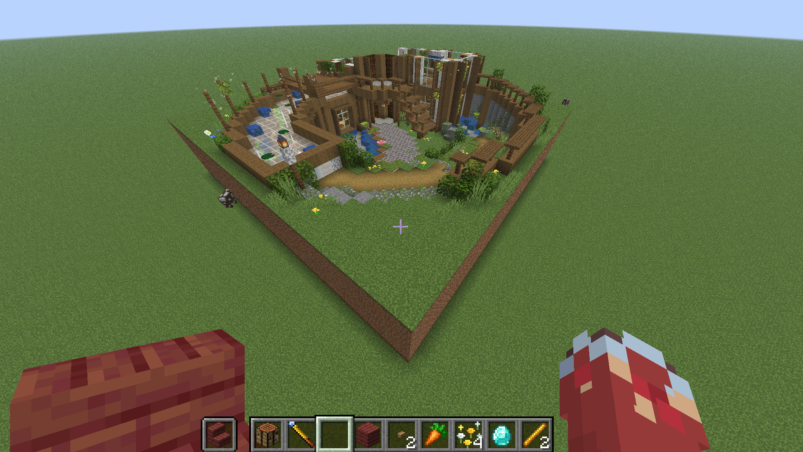

<p align="center">
<b>Minecraft 26.2 · Fabric</b> ·
<a href="https://modrinth.com/mod/omni-build-wand">Modrinth</a> ·
必需依赖 / Required: <a href="https://modrinth.com/mod/fabric-api">Fabric API</a> · <a href="https://modrinth.com/mod/litematica">Litematica</a> · <a href="https://modrinth.com/mod/malilib">MaLiLib</a>
</p>

<p align="center"><b>🌐 点击下方语言展开 / Click a language below to expand</b></p>

<!-- ============================== 中文 ============================== -->
<details open>
<summary><b>🇨🇳 中文教程（点击展开 / 收起）</b></summary>

<br>

## 📦 安装

1. 安装 [Fabric Loader](https://fabricmc.net/use/) 与 [Fabric API](https://modrinth.com/mod/fabric-api)。
2. 安装 [Litematica](https://modrinth.com/mod/litematica) + [MaLiLib](https://modrinth.com/mod/malilib)（蓝图与幽灵预览所需，**必需**）。
3. 把 `omnibuild-wand-x.x.x.jar` 放进 `.minecraft/mods/`。
4. 进游戏即可。

## 🛠️ 合成

钻石 ×1 + 烈焰棒 ×2，斜向排布：

```
· · D        D = 钻石 Diamond
· B ·        B = 烈焰棒 Blaze Rod
B · ·
```

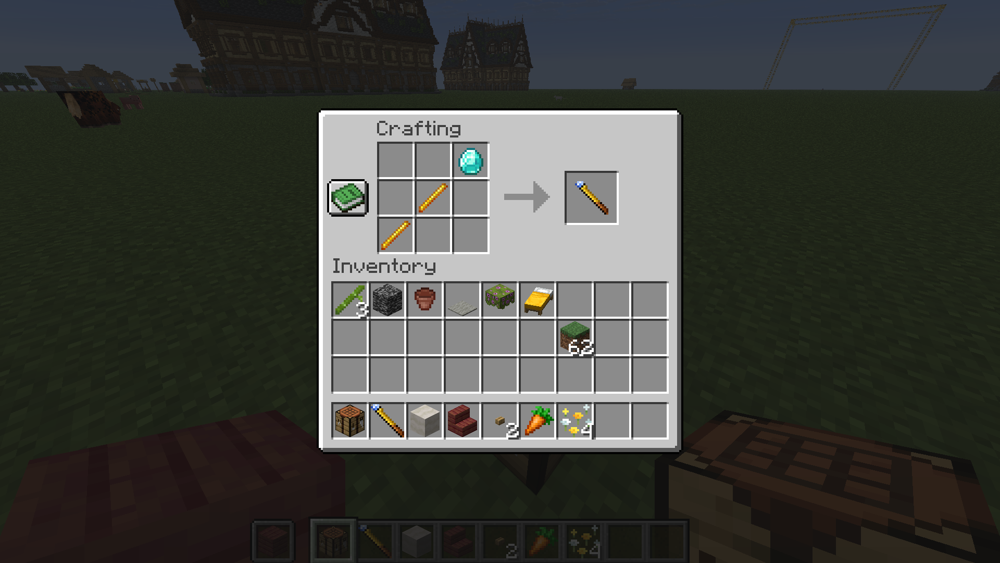

## 🎮 基础概念

- **手持手杖右键**＝选角 / 执行操作。大多数操作是「右键选第一个角 → 再右键选第二个角 → 完成」。
- 按 **`N`** 在六种模式间循环切换：**填充 → 复制/粘贴 → 替换 → 移动 → 供料链接 → 采集**。
- 按 **`V`** 在 **方形 → 智能 → 连锁选区** 间循环切换。
- **`Shift` + 右键**＝重置当前选区，重新开始。
- 生存模式会**真实扣除背包材料**（可从快捷栏或副手的**潜影盒**里取）；材料不够时可改用「工地」慢慢囤料建造（见下文）。

---

## 🟦 填充模式 Fill

把一个长方体范围内的空位填成你指定的方块。

1. 把要填充的方块放进**副手或快捷栏**。
2. 右键点第一个角 → 右键点对角，范围内的**空位立即填满**。

> 「空位」不只是空气：草、海草、水、岩浆、雪层等**可被覆盖的方块**都会被一并填上（凡是右键能直接放方块的位置都算）。

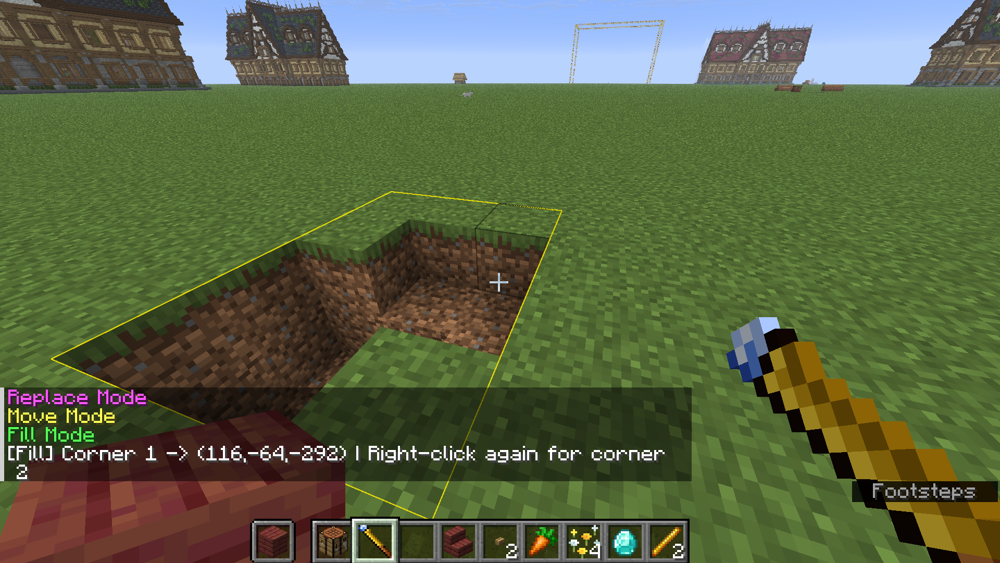

## 📋 复制 / 粘贴模式 Copy

原样复制一片结构，粘到别处，支持旋转和镜像。

1. 右键选两个角，框住要复制的结构 → 自动记录到剪贴板。
2. 移动到目标位置，右键即可**粘贴**。
3. 粘贴前可按 **`R` 旋转**、**`B` 镜像** 调整朝向（会有幽灵预览）。

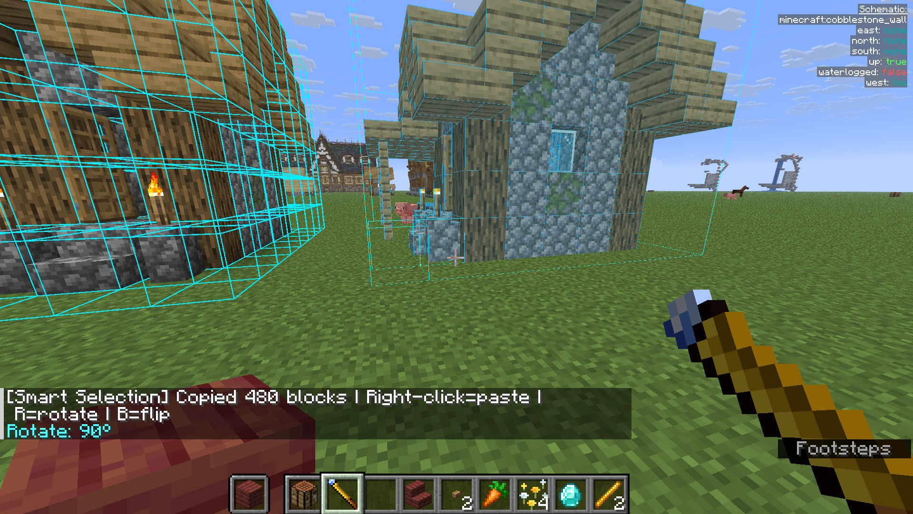

## ♻️ 替换模式 Replace

把范围内某一种方块批量换成另一种。

1. 把**要替换成**的新方块放进副手 / 快捷栏。
2. 右键选两个角框定范围。
3. 第三次右键**点击你想被替换掉的那种方块**，范围内所有同类方块即被替换。

| 替换前 | 替换后 |
| --- | --- |
| 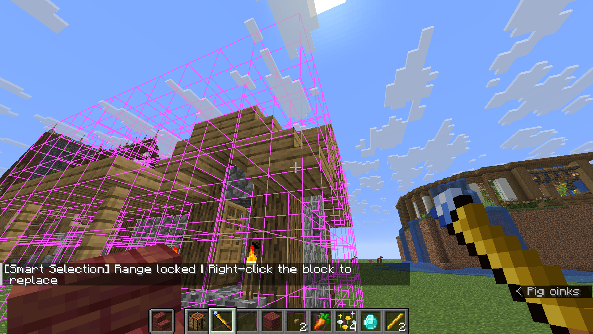 | 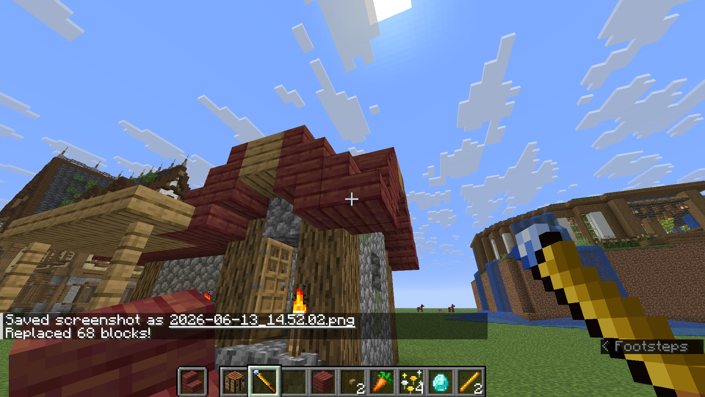 |

## 🚚 移动模式 Move

把整块建筑连根挪到新位置（原地清空），支持旋转 / 镜像。

1. 右键选两个角框住要搬的建筑 → 记录。
2. 右键点目标位置即可**整体移动**过去；同样支持 `R` / `B`。

| 移动前 | 移动后 |
| --- | --- |
| 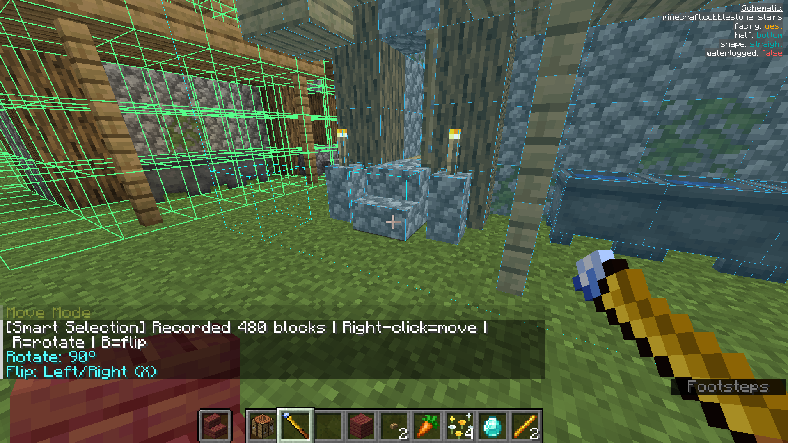 | 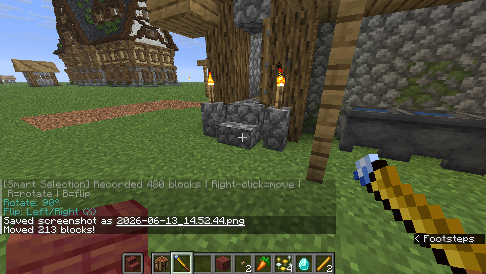 |

## 🧠 智能选区 Smart Selection

不想手点角落框范围？按 **`V`** 切到智能选区，右键一个方块，它会**自动识别整片连续的建筑体**并锁定，再次右键确认即可执行（复制 / 替换 / 移动 都能用）。适合形状不规则的结构。

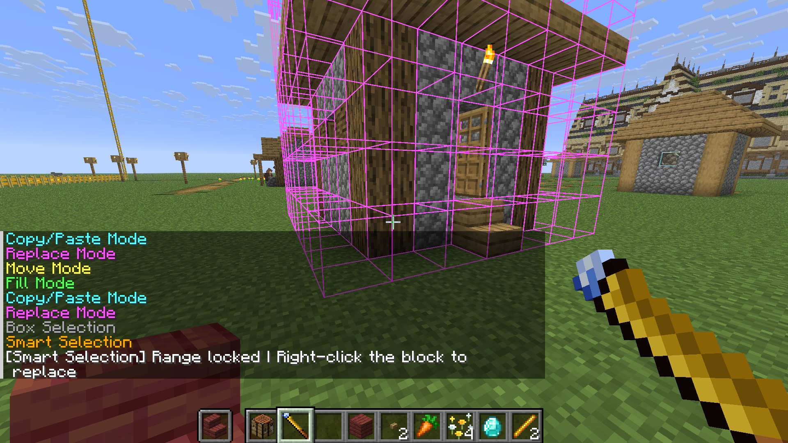

> 扫描 / 方块上限可在 `/wand settings` 里调（默认扫描 80,000 格、最多选中 25,000 方块）。

## ⛓️ 连锁选区 Chain Selection

再按一次 **`V`** 切到**连锁选区**：右键一个方块，只会沿**同种方块**蔓延选取（26 方向连通，斜着相邻也算），同样是「右键圈选 → 锁定 → 再右键确认」。

- 点**原木**只选连通的原木（不带树叶）、点**矿石**只选同种矿脉、点**石头**只选连通石头。
- 与智能选区共用同一套上限，超出即失败，不会爆炸。
- 配合**采集模式**就是「连锁伐木 / 连锁挖矿」；用在复制 / 移动上则能只挑出同种方块。

---

## 🏗️ 工地系统（招牌功能）

大型工程不想一次性掏空仓库？把它变成「工地」，慢慢囤料、自动施工。

1. 在复制 / 粘贴或蓝图模式下，材料不足时会**自动转为工地**（也可主动选择）。地面上会立起一个**工地牌**。

   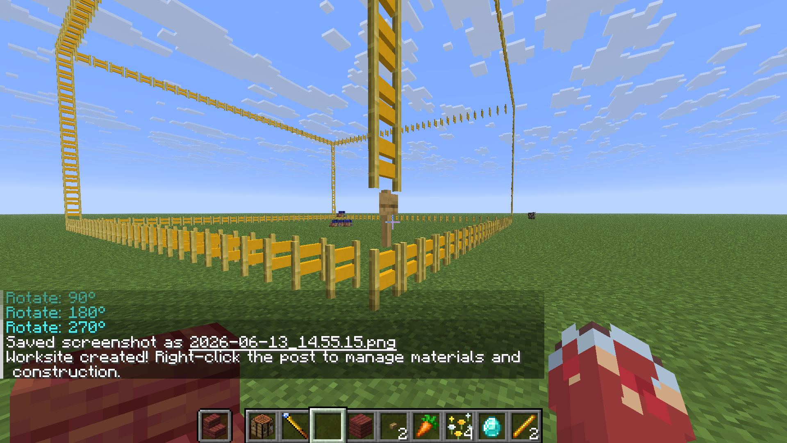

2. **右键工地牌**打开管理站：左侧列出所需材料与已投入数量。把材料丢进去「存入材料」。

   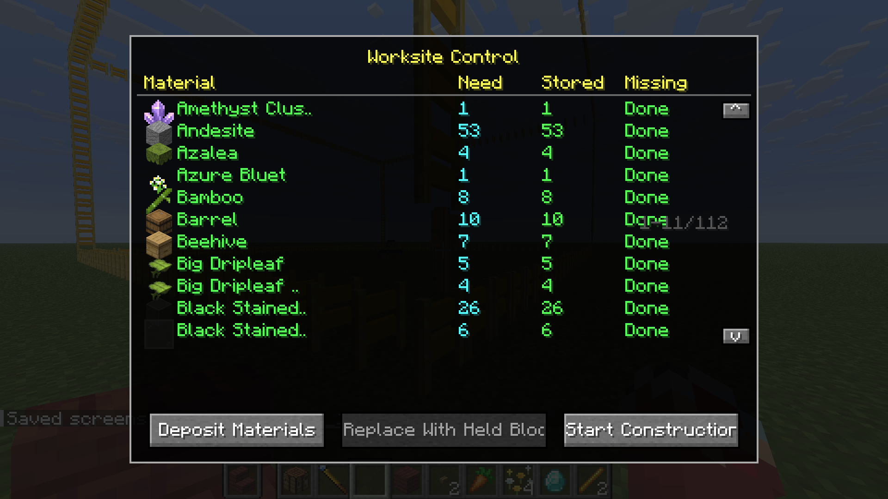

3. 材料够了点「**开始施工**」，工地就会**自动逐块建造**，直到完工。

   

> 管理站还有两个按钮：**「取回材料」**把已存入工地的材料退回背包（施工中不可用）；**「从箱子补料」**配合下面的「供料链接」一键补料。

## 🔗 供料链接 Supply Link（接箱子自动供料）

懒得手动往工地搬材料？把附近的箱子接上，工地施工时**自动取料**。

1. 按 `N` 切到 **供料链接** 模式。
2. 右键框选两个角，把装材料的**箱子 / 木桶 / 潜影盒**圈进去（**箱子里的潜影盒也算**）。
3. 再**右键工地牌**完成链接，提示「已链接 N 个容器」。
4. 在管理站点 **「从箱子补料」**，或直接**开始施工**——施工时每秒自动从这些容器取料边抽边盖。

> 🛡️ 安全机制：每个容器、每种材料**至少保留 1 个**，绝不把箱子抽空。

## 📐 Litematica 蓝图导入

把外部 `.litematic` 蓝图直接变成工地来施工：

1. 手持手杖，输入命令：`/wand load <蓝图文件路径>`（路径可带引号）。
2. 加载成功后会显示方块总数，右键地面即可**生成对应工地**，之后流程同上。

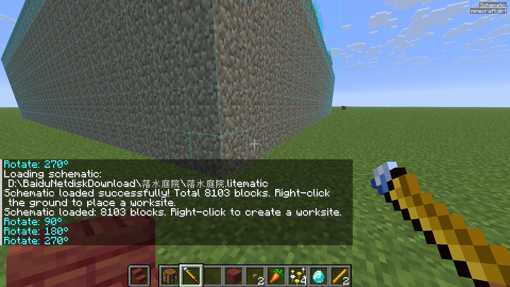

## 📤 导出蓝图（分享给好友）

把手杖里复制好的结构**导出成 `.litematic` 文件**，发给好友或上传分享：

1. 在复制 / 移动模式下框选结构（或先用 `/wand load` 加载一个蓝图）。
2. 输入 `/wand export <名字>`（不写名字会用时间戳自动命名）。
3. 文件保存到 `.minecraft/schematics/`，把这个 `.litematic` 发给好友即可（好友用本手杖 `/wand load` 或 Litematica 都能打开）。

> 导出的是结构的**原始朝向**；只记录方块本身，不含箱子里的物品 / 告示牌文字（与复制行为一致）。

## ⛏️ 采集模式 Harvest（用副手工具批量采集）

把一片范围里的方块**用副手的工具**一次性采下来——相当于让工具替你挖矿、伐木、清地基，且**正常触发工具的全部附魔**（时运、精准采集、耐久附魔都生效）。

1. 按 `N` 切到 **采集** 模式（红字），主手拿手杖、**副手放一把工具**（镐 / 斧 / 锹 / 剪刀…）。
2. 用**方形 / 智能 / 连锁**任一种选区框出范围（按 `V` 切换）。
3. 锁定后**再右键确认**，即用副手那把工具把范围内的方块全部采下，掉落物直接进背包。

> ⚠️ 副手**必须**是可损耗的工具，否则报错返回。
> 🛡️ 当工具**耐久只剩 1 点时自动停手**（此时可能是采了一半的状态），绝不会把工具挖断——换把工具再来一次即可。
> 掉落严格按工具与附魔结算：拿错工具（如用锹挖石头）不掉落，精准采集得方块本体，时运提高产量。

## ⌨️ 按键速查

| 按键 | 作用 |
| --- | --- |
| 右键 | 选角 / 执行 |
| `Shift` + 右键 | 重置选区 |
| `R` | 旋转 |
| `B` | 镜像 |
| `N` | 切换模式（填充/复制/替换/移动/供料链接/采集） |
| `V` | 方形 / 智能 / 连锁选区 循环切换 |
| `/wand settings` | 打开设置（智能选区上限） |
| `/wand load <path>` | 加载 Litematica 蓝图 |
| `/wand export <名字>` | 导出当前结构为 .litematic 蓝图 |

</details>

<!-- ============================== English ============================== -->
<details>
<summary><b>🇬🇧 English Guide (click to expand)</b></summary>

<br>

## 📦 Installation

1. Install [Fabric Loader](https://fabricmc.net/use/) and [Fabric API](https://modrinth.com/mod/fabric-api).
2. Install [Litematica](https://modrinth.com/mod/litematica) + [MaLiLib](https://modrinth.com/mod/malilib) (**required** — for blueprints & ghost preview).
3. Drop `omnibuild-wand-x.x.x.jar` into `.minecraft/mods/`.
4. Launch the game.

## 🛠️ Crafting

1× Diamond + 2× Blaze Rod, diagonal layout:

```
· · D        D = Diamond
· B ·        B = Blaze Rod
B · ·
```


## 🎮 Core concepts

- **Right-click with the wand** = pick a corner / execute. Most actions are *right-click corner 1 → right-click corner 2 → done*.
- Press **`N`** to cycle the six modes: **Fill → Copy/Paste → Replace → Move → Supply Link → Harvest**.
- Press **`V`** to cycle **Box → Smart → Chain Selection**.
- **`Shift` + Right-click** = reset the current selection.
- In Survival it **actually consumes materials** from your hotbar/offhand (including **shulker boxes**). Short on materials? Build it as a *worksite* instead (see below).

---

## 🟦 Fill Mode

Fill every open spot in a box region with a chosen block.

1. Put the fill block in your **offhand or hotbar**.
2. Right-click corner 1 → right-click the opposite corner. The open spots fill instantly.

> "Open" isn't just air: grass, seagrass, water, lava, snow layers and other **replaceable blocks** all get filled over too (anywhere you could right-click to place a block).


## 📋 Copy / Paste Mode

Copy a structure and paste it elsewhere, with rotate & flip.

1. Right-click two corners around the structure → it's saved to the clipboard.
2. Move to the target spot and right-click to **paste**.
3. Before pasting, press **`R` to rotate** / **`B` to flip** (a ghost preview shows the result).


## ♻️ Replace Mode

Swap one block type for another in bulk within a region.

1. Put the **replacement** block in your offhand / hotbar.
2. Right-click two corners to define the region.
3. Third right-click **on the block type you want replaced** — every matching block in the region is swapped.

| Before | After |
| --- | --- |
|  |  |

## 🚚 Move Mode

Relocate a whole build to a new spot (source is cleared), with rotate / flip.

1. Right-click two corners around the build → recorded.
2. Right-click the target position to **move** it there. `R` / `B` supported.

| Before | After |
| --- | --- |
|  |  |

## 🧠 Smart Selection

Don't want to click corners? Press **`V`** for Smart Selection: right-click one block and it **auto-detects the entire contiguous structure** and locks it; right-click again to confirm and execute (works with Copy / Replace / Move). Great for irregular shapes.


> Tune the scan / block limits in `/wand settings` (defaults: 80,000-cell scan, 25,000 blocks max).

## ⛓️ Chain Selection

Press **`V`** once more for **Chain Selection**: right-click a block and it spreads only through **blocks of the same type** (26-direction connectivity, so diagonal touches count too) — same lock-then-confirm flow.

- Click a **log** → only the connected logs (no leaves); click an **ore** → just that vein; click **stone** → only connected stone.
- Shares the same limits as Smart Selection, so it fails rather than exploding.
- With **Harvest mode** this becomes "chain-chop / vein-mine"; with Copy / Move it cherry-picks one block type.

---

## 🏗️ Worksite System (the headline feature)

Big project, don't want to drain your whole inventory at once? Turn it into a *worksite* — stock materials over time and let it build itself.

1. In Copy/Paste or Blueprint mode, if you're short on materials it **auto-converts to a worksite** (you can also choose this). A **worksite post** appears on the ground.

   

2. **Right-click the post** to open the dashboard: it lists required materials and how much you've deposited. Deposit materials there.

   

3. Once materials are sufficient, hit **Start Construction** and the worksite **builds itself block by block** until done.

   

> The dashboard also has two buttons: **Withdraw Materials** returns deposited materials to your inventory (disabled while building); **Pull from Chests** works with Supply Link below.

## 🔗 Supply Link (auto-feed from chests)

Don't want to haul materials to the worksite by hand? Link nearby chests and it **pulls materials automatically** while building.

1. Press `N` to switch to **Supply Link** mode.
2. Right-click two corners around your **chests / barrels / shulker boxes** (shulker boxes *inside* chests count too).
3. Then **right-click the worksite post** to link — it reports "Linked N containers".
4. Click **Pull from Chests** in the dashboard, or just **Start Construction** — it pulls from those containers every second as it builds.

> 🛡️ Safety: each container always keeps **at least one** of every material — chests are never fully emptied.

## 📐 Litematica Blueprint Import

Turn an external `.litematic` schematic straight into a worksite:

1. Hold the wand and run: `/wand load <path to .litematic>` (quotes allowed).
2. On success it reports the block count; right-click the ground to **spawn the matching worksite**, then proceed as above.


## 📤 Export & Share

Save the structure copied in your wand as a **`.litematic` file** to share with friends:

1. Select a structure in Copy / Move mode (or load one first with `/wand load`).
2. Run `/wand export <name>` (omit the name to auto-name it with a timestamp).
3. The file is saved to `.minecraft/schematics/` — send that `.litematic` to friends (openable with this wand's `/wand load` or with Litematica).

> Exports the structure in its original orientation; only block states are stored (no chest contents / sign text), matching Copy behavior.

## ⛏️ Harvest Mode (bulk-mine with your offhand tool)

Mine a whole region **using the tool in your offhand** — let it dig, fell trees or clear foundations for you, with **all of the tool's enchantments applying** (Fortune, Silk Touch, Unbreaking all work).

1. Press `N` to switch to **Harvest** mode (red), hold the wand in your main hand and **a tool in your offhand** (pickaxe / axe / shovel / shears…).
2. Select a region with **Box / Smart / Chain** selection (`V` to switch).
3. Once locked, **right-click again to confirm** — the offhand tool mines everything in range, drops go straight to your inventory.

> ⚠️ The offhand **must** hold a damageable tool, otherwise it errors out.
> 🛡️ It **stops automatically when the tool is down to its last durability point** (which may leave a region half-harvested) — it will never snap your tool. Swap in a fresh tool and run it again.
> Drops follow the tool & its enchantments exactly: wrong tool (e.g. shovel on stone) yields nothing, Silk Touch gives the block itself, Fortune boosts yield.

## ⌨️ Controls cheat sheet

| Key | Action |
| --- | --- |
| Right-click | Pick corner / execute |
| `Shift` + Right-click | Reset selection |
| `R` | Rotate |
| `B` | Flip |
| `N` | Switch mode (Fill/Copy/Replace/Move/Supply Link/Harvest) |
| `V` | Cycle Box / Smart / Chain Selection |
| `/wand settings` | Open settings (Smart Selection limits) |
| `/wand load <path>` | Load a Litematica schematic |
| `/wand export <name>` | Export current structure as a .litematic schematic |

</details>

---

## 🧱 从源码构建 / Build from source

```bash
./gradlew clean build
# 产物 / Output: build/libs/omnibuild-wand-x.x.x.jar
```

需 JDK 21+（本项目用 JDK 25）。编辑中文资源后务必 `clean build`，并保持 `lang/zh_cn.json` 用 `\uXXXX` 转义。

## 📄 License

MIT — see [LICENSE](LICENSE). Litematica / MaLiLib are external runtime dependencies; their code is not included here.
